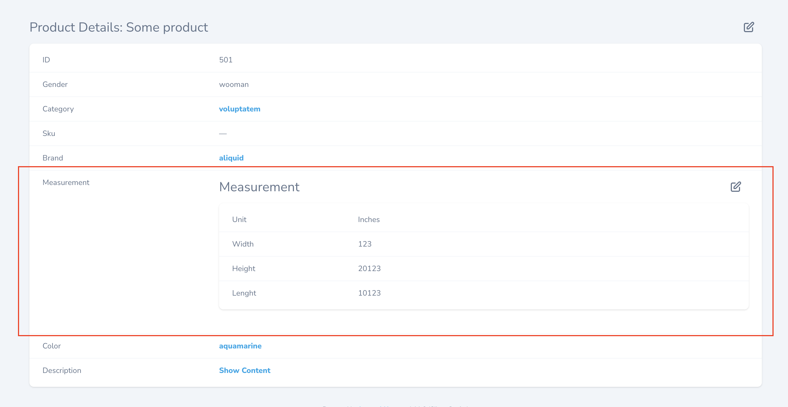
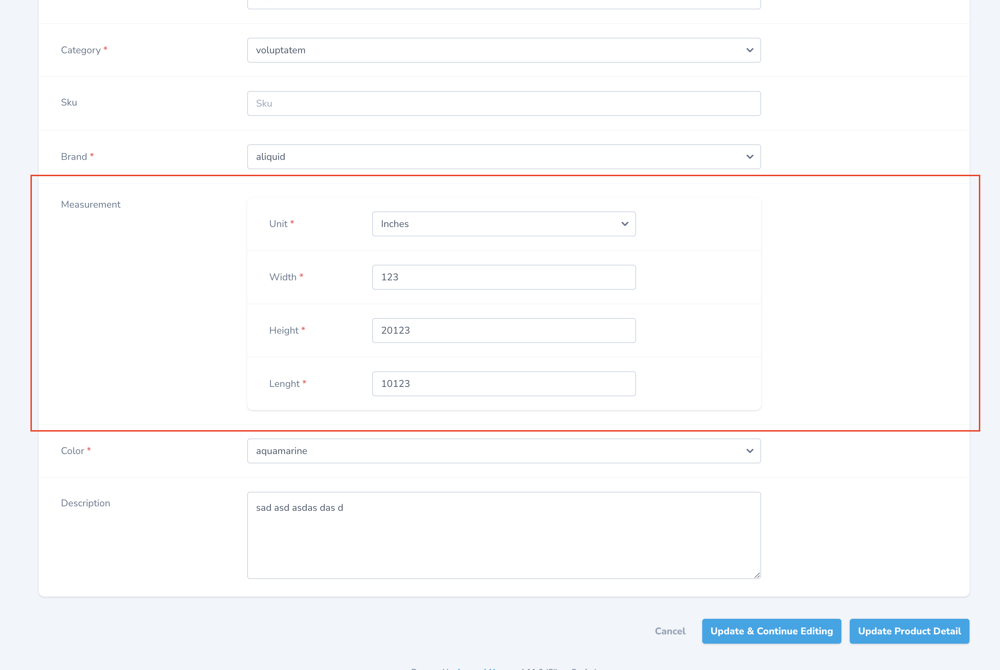

# Nova HasOne Inject

This package inherits the main features of HasOne field and allows it to be injected in the form between other fields.

## Requirements

- PHP 8.0.2+
- Nova 4+

## Screenshots





### Installation

This package can be installed via command:

```bash
composer require aqjw/nova-has-one-inject-field
```

### Usage

```php
use Aqjw\HasOneInjectField\HasOneInjectField;
...
return [
    ...
    HasOneInjectField::make('Measurement', 'measurement', \App\Nova\Measurement::class),
    ...
];
```

> **Warning**
> This is a beta version, so the field may be unstable.

### License

The MIT License (MIT). Please see License File for more information.
